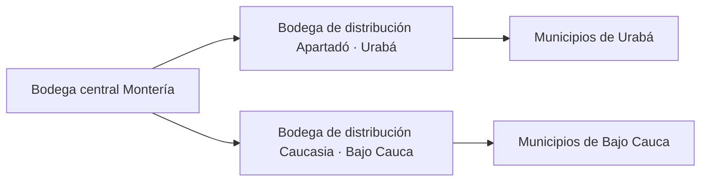

# Inventario: distribución zonal

## Flujo operativo vigente

La **bodega central Oficina central Montería** recibe las compras y define desde Compras la asignación final de productos para cada municipio. La distribución física tiene dos tramos obligatorios:

1. **Compras** asigna cada producto, cantidad, municipio final y supervisor receptor.
2. El sistema agrupa las asignaciones por zona y crea un envío consolidado desde Montería a Apartadó o Caucasia.
3. El **coordinador de zona** recibe el consolidado con biometría, GPS, fecha, hora y dispositivo. Solo esta recepción aumenta el saldo de la bodega zonal.
4. Se habilitan los envíos municipales definidos inicialmente por Compras. El coordinador los despacha sin cambiar destino ni cantidades.
5. El **supervisor asignado** recibe el envío municipal con biometría, GPS, fecha, hora y dispositivo. Solo entonces aumenta el saldo municipal.
6. Las salidas de campo reducen el saldo de la bodega municipal; las salidas desde la bodega zonal reducen su propio saldo.

## Ubicaciones

| Ubicación | Tipo técnico | Responsable |
| --- | --- | --- |
| Oficina central Montería | `CENTRAL_WAREHOUSE` | Compras |
| Bodega de distribución Apartadó | `DISTRIBUTION_WAREHOUSE` | Coordinador de Urabá |
| Bodega de distribución Caucasia | `DISTRIBUTION_WAREHOUSE` | Coordinador de Bajo Cauca |
| Cada municipio | `MUNICIPAL_WAREHOUSE` | Supervisor municipal |

Apartadó y Caucasia pueden tener además su propia bodega municipal. Esta es distinta de la bodega de distribución para no mezclar custodia zonal con stock municipal.

## Reglas no negociables

- Compras define las asignaciones municipales antes del primer despacho.
- Solo Compras despacha Montería → bodega zonal.
- Solo el coordinador de la zona despacha bodega zonal → municipios de su zona.
- El coordinador no puede despachar una asignación hasta que el consolidado esté recibido completamente.
- El coordinador no puede alterar productos, cantidades, municipio ni supervisor definidos por Compras.
- La recepción zonal exige coordinador de la zona; la municipal exige supervisor del municipio destino.
- Cada tramo descuenta origen, registra tránsito y aumenta destino únicamente después de la recepción biométrica.
- No se admiten saldos negativos ni modificaciones destructivas del ledger.

## Trazabilidad y alertas

Cada envío municipal conserva su envío consolidado padre. Compras ve la cadena completa: creación, despacho central, recepción zonal, despacho municipal y recepción municipal. Las alertas cubren tránsito, recepción parcial, discrepancias, falta de stock y comandos pendientes de sincronización.

## Dashboard de Resumen

El Resumen consolida stock, alertas, envíos activos y cobertura territorial. La red se representa sobre Google Maps con un nodo accesible por municipio:

- Montería se muestra como origen central.
- Apartadó y Caucasia se muestran como puntos de distribución; cada nodo separa el saldo zonal del saldo municipal.
- Las rutas representan Montería → bodega zonal → municipios de la zona.
- Al seleccionar un punto se muestran existencias, SKU, alertas, envíos en camino, responsable y última actualización.
- Las coordenadas pertenecen al maestro `Municipio`; no se geocodifican nombres en cada carga.
- La clave web se inyecta en tiempo de ejecución mediante `GOOGLE_MAPS_API_KEY` y debe restringirse por dominio y por Maps JavaScript API. `GOOGLE_MAPS_MAP_ID` configura el estilo y los marcadores avanzados.
- Si Google Maps no está configurado o no está disponible, el Resumen conserva una vista seleccionable de los municipios y sus indicadores; el resto del módulo no se bloquea.

## Protección offline

La aplicación cifra el contexto y la cola local por usuario. Primero confirma la transacción local y luego sincroniza; reintentos idempotentes, leases y backoff impiden pérdidas o duplicados. Las salidas pendientes reservan saldo local para impedir sobreconsumo sin conexión.

## Criterios de aceptación

- [ ] Apartadó y Caucasia existen como bodegas zonales activas, asignadas a sus coordinadores.
- [ ] Compras puede crear asignaciones finales para municipios y el sistema las agrupa por zona.
- [ ] El envío a la bodega zonal solo puede recibirlo su coordinador con biometría.
- [ ] Los envíos municipales solo se despachan tras recibir el consolidado zonal.
- [ ] Los supervisores solo reciben inventario de su propio municipio con biometría.
- [ ] Web y móvil muestran el tramo, responsable, tiempos y estado de la cadena.
- [ ] Los balances y el ledger concilian para ambos tramos.
