# Inventario municipal: plan operativo vigente

Este documento define el flujo simple del módulo de inventario. La complejidad técnica existe para proteger los datos, pero no debe trasladarse a la operación diaria.

## Decisión principal

Compras administra el catálogo y envía cantidades desde una bodega central a una bodega municipal existente. En cada envío debe seleccionar una persona responsable entre:

- un supervisor del municipio destino; o
- el coordinador de la zona a la que pertenece ese municipio.

El inventario municipal **no aumenta al crear ni al despachar el envío**. Aumenta únicamente cuando la persona seleccionada confirma la recepción con biometría desde la aplicación móvil.

Después de la recepción, los supervisores autorizados registran las salidas de campo y esas salidas disminuyen el stock compartido del municipio.

```mermaid
flowchart LR
    A["Catálogo de productos"] --> B["Compras asigna cantidades"]
    B --> C["Selecciona municipio y responsable"]
    C --> D["Despacha desde bodega central"]
    D --> E["Stock en tránsito"]
    E --> F["Responsable confirma con biometría"]
    F --> G["Stock de bodega municipal"]
    G --> H["Supervisor registra salidas"]
    H --> I["Disminuye stock municipal"]
```



## Camino rápido por rol

### Compras

1. Mantiene el catálogo de productos.
2. Consulta existencias y alertas por bodega municipal.
3. Crea un envío indicando bodega central, municipio, responsable y cantidades.
4. Revisa el borrador y lo despacha.
5. Supervisa envíos pendientes de recepción o con diferencias.

### Supervisor o coordinador receptor

1. Abre Inventario en la aplicación móvil.
2. Consulta los envíos que le fueron asignados personalmente.
3. Verifica las cantidades físicas.
4. Confirma con huella o reconocimiento facial.
5. La aplicación guarda primero la recepción en almacenamiento local cifrado.
6. Si no hay conexión, la recepción queda pendiente y se sincroniza automáticamente después.

### Supervisor que entrega materiales

1. Selecciona el producto y la cantidad que sale de la bodega municipal.
2. Confirma la salida.
3. La aplicación guarda el registro localmente antes de mostrar éxito.
4. El stock municipal disminuye al aplicar el comando en el servidor.

## Reglas de negocio obligatorias

| Tema | Regla |
| --- | --- |
| Destino | Debe ser una bodega municipal activa ya vinculada a un municipio y una zona existentes. |
| Responsable | Es obligatorio y debe existir en la base de datos. |
| Supervisor elegible | Su municipio y su zona deben coincidir con los de la bodega destino. |
| Coordinador elegible | Su `coordinatedZoneId` debe coincidir con la zona de la bodega destino. |
| Cambio de responsable | Solo se permite mientras el envío esté en borrador. |
| Despacho | Reduce la bodega central y registra las cantidades como inventario en tránsito. |
| Recepción | Solo la puede confirmar el usuario asignado al envío. |
| Biometría | La recepción requiere biometría real; el PIN o patrón del teléfono no son sustitutos. |
| Entrada municipal | Se genera al aplicar la recepción, nunca al crear o despachar. |
| Salida municipal | Disminuye el saldo compartido del municipio de forma atómica. |
| Stock negativo | Ningún comando aplicado puede dejar un balance negativo. |
| Diferencias | Faltantes, daños o cantidades parciales se conservan para revisión; no se ocultan. |
| Cantidades | Se transportan como decimales exactos y se almacenan con seis posiciones decimales. |

## Qué ve Compras en la web

La interfaz de Compras debe tener solo tres áreas principales:

### 1. Stock y alertas

Muestra:

- stock actual por municipio y producto;
- mínimo configurado;
- faltante frente al mínimo;
- envíos despachados aún no recibidos;
- recepciones parciales o con diferencias.

No debe mostrar un cero falso mientras una consulta esté cargando o haya fallado.

### 2. Productos

Permite:

- crear productos con SKU, nombre y unidad base;
- activar o desactivar productos;
- agregar versiones de unidad cuando sea necesario.

Los municipios, zonas, supervisores y coordinadores no se crean desde Inventario. Se reutilizan los registros maestros existentes.

### 3. Asignar a municipios

El formulario solicita, en este orden:

1. bodega central de origen;
2. municipio o bodega municipal destino;
3. responsable de recepción elegible;
4. productos y cantidades;
5. observaciones opcionales.

Al cambiar el municipio, la lista de responsables se vuelve a filtrar. No se puede guardar ni despachar sin un responsable válido.

## Estados del envío

| Estado | Significado operativo |
| --- | --- |
| `DRAFT` | Compras todavía puede editar destino, responsable y cantidades. |
| `DISPATCHED` | El material salió de la bodega central y está pendiente de recepción. |
| `PARTIALLY_RECEIVED` | El responsable confirmó solo parte de lo enviado. |
| `DISCREPANCY_REVIEW` | Existen faltantes, daños o una diferencia que requiere revisión. |
| `RECEIVED` | Todo lo enviado quedó contabilizado en destino. |
| `CANCELLED` | El borrador fue cancelado antes de completar el flujo. |
| `RETURNED` | El material fue devuelto según el proceso de revisión. |
| `CLOSED_WITH_DISCREPANCY` | El envío se cerró conservando una diferencia auditada. |

## Protección contra pérdida de datos

### En el teléfono

- Cada usuario tiene una base local cifrada y una llave distinta protegida por el sistema operativo.
- Una acción móvil se considera guardada solo después de confirmar la transacción local.
- La cola de salida conserva el payload original, incluso después del acuse del servidor.
- Cerrar la aplicación, reiniciar el teléfono, perder la red o recibir una respuesta HTTP incompleta no elimina el registro.
- La sincronización usa lease, reintentos y backoff para impedir que dos workers procesen el mismo elemento al mismo tiempo.
- Un cierre de sesión o un error de autenticación bloquea temporalmente el envío, pero no borra la cola.

### En el servidor

- Cada acción móvil usa un `clientCommandId` UUID estable.
- Repetir exactamente la misma acción produce el mismo resultado y no duplica movimientos.
- Reutilizar el identificador con otro contenido se rechaza como conflicto.
- El ledger de movimientos es inmutable; una corrección crea un reverso o ajuste compensatorio.
- El balance se actualiza dentro de la misma transacción de PostgreSQL que registra el comando y el movimiento.
- Los comandos que requieren intervención permanecen en `NEEDS_REVIEW`; nunca se descartan silenciosamente.

> Límite físico: ningún almacenamiento local puede proteger un registro que todavía no se sincronizó si el usuario desinstala la aplicación, borra sus datos o pierde definitivamente el teléfono. La interfaz debe mostrar claramente qué elementos siguen pendientes.

## Confirmación biométrica

La recepción registra para auditoría:

- usuario asignado y usuario que ejecutó la acción;
- método `BIOMETRIC`;
- identificador del dispositivo cuando está disponible;
- fecha y hora UTC capturada en el teléfono;
- desfase horario local;
- cantidades recibidas, dañadas y faltantes;
- `clientCommandId` usado para idempotencia.

El backend vuelve a comprobar la identidad y la elegibilidad. Ocultar opciones en la interfaz no reemplaza esta validación.

## Contratos principales

| Operación | Contrato |
| --- | --- |
| Cargar contexto móvil | `GET /inventario/context` |
| Sincronizar salidas | `POST /inventario/sync` |
| Listar responsables existentes | `GET /inventario/assignees` |
| Crear envío | `POST /inventario/shipments` con `receiverUserId` obligatorio |
| Editar borrador | `PATCH /inventario/shipments/:id` |
| Despachar | `POST /inventario/shipments/:id/dispatch` |
| Confirmar recepción | `POST /inventario/shipments/:id/receipts` con biometría y `clientCommandId` |
| Consultar stock | `GET /inventario/balances` |
| Consultar alertas | `GET /inventario/alerts` |

## Modelo de datos mínimo

- `Product`: catálogo maestro.
- `InventoryLocation`: detalle técnico interno para llevar el ledger. Cada municipio tiene una única ubicación municipal automática, presentada en la interfaz simplemente como **Municipio**.
- `InventoryBalance`: saldo actual por ubicación y producto.
- `InventoryCommand`: inbox idempotente y estado de aplicación.
- `InventoryMovement`: ledger inmutable.
- `Shipment`: origen, destino, estado y `receiverUserId`.
- `ShipmentItem`: cantidad enviada y acumulados recibidos, dañados o faltantes.
- `ShipmentReceipt`: auditoría de cada confirmación biométrica.
- `InventoryLocationAssignment`: autorización vigente del usuario sobre una bodega.
- `StockMinimum`: umbral de alerta por bodega y producto.

## Invariantes contables

```text
stock disponible = suma de movimientos aplicados en la ubicación

al despachar:
  bodega central -= cantidad enviada
  tránsito       += cantidad enviada

al recibir:
  tránsito       -= cantidad aceptada
  bodega municipal += cantidad aceptada

al registrar salida:
  bodega municipal -= cantidad entregada
```

Todas las operaciones anteriores deben ser transaccionales. Si una validación falla, no se aplica ningún movimiento parcial.

## Alertas mínimas

Compras necesita como mínimo:

- `STOCK_BELOW_MINIMUM`: saldo menor al mínimo configurado;
- envío despachado pendiente de recepción;
- recepción parcial;
- envío con discrepancia;
- comando en revisión.

Las alertas informan; no modifican inventario automáticamente.

## Funciones avanzadas

Conteos físicos, conciliación, reversos, importación de saldos iniciales y revisión de conflictos se conservan como herramientas administrativas. No forman parte del camino diario de Compras y por eso no deben competir visualmente con las tres áreas principales.

## Criterios de aceptación

- [ ] Compras solo puede elegir una bodega municipal existente como destino.
- [ ] El selector ofrece supervisores del municipio y el coordinador de la zona, sin personas de otros alcances.
- [ ] Backend rechaza un responsable de otro municipio o zona aunque se manipule la petición.
- [ ] El envío no se despacha sin responsable.
- [ ] Solo el responsable asignado puede confirmar la recepción.
- [ ] La recepción falla si el dispositivo no completa biometría real.
- [ ] La recepción queda cifrada y pendiente cuando no hay conexión.
- [ ] Reintentar una recepción no duplica stock ni movimientos.
- [ ] El stock municipal aumenta únicamente tras la recepción aplicada.
- [ ] Una salida de supervisor reduce el stock municipal sin permitir negativos.
- [ ] Compras puede ver stock, mínimos, envíos pendientes y diferencias.
- [ ] Los registros maestros de municipios y personas no se duplican.

## Verificación técnica antes de publicar

1. Ejecutar pruebas unitarias del dominio de inventario y compilar NestJS.
2. Ejecutar pruebas del filtro de responsables, typecheck y build de React.
3. Ejecutar `flutter analyze` y las pruebas de cifrado, outbox, captura y sincronización.
4. Ensayar la migración Prisma sobre una base temporal con el esquema previo.
5. Aplicar `prisma migrate deploy` en producción.
6. Confirmar que Prisma no reporte migraciones pendientes.
7. Verificar que los envíos abiertos tengan un responsable elegible.

## Fuera de alcance de este flujo

- crear municipios, zonas, supervisores, coordinadores o bodegas municipales desde Inventario;
- permitir que Compras confirme recepciones en nombre del responsable;
- aumentar stock por el solo hecho de crear un envío;
- usar credenciales del dispositivo como sustituto de biometría;
- borrar eventos locales pendientes para resolver errores de sincronización;
- editar o eliminar movimientos históricos.
