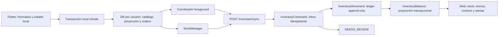
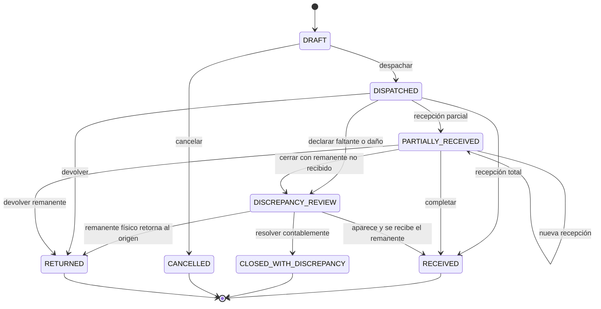

# Plan definitivo del módulo de inventario

> Estado: diseño ejecutable para implementación por fases. Este documento reemplaza el borrador anterior.
>
> Objetivo: registrar, proteger y sincronizar el inventario de campo sin perder eventos ante desconexiones, cierres de la aplicación, reinicios o respuestas HTTP perdidas, manteniendo trazabilidad contable, separación por rol y consistencia transaccional en PostgreSQL.

## 1. Dictamen y decisiones adoptadas

La solución será **offline-first obligatoria**. El éxito de una acción en Flutter significa primero “confirmada en almacenamiento local cifrado”; nunca significa que el servidor ya la recibió salvo que la interfaz muestre explícitamente el acuse remoto.

La garantía técnica será:

- **Entrega al menos una vez** desde el teléfono.
- **Efecto una sola vez** en el backend mediante `clientEventId` estable, hash canónico calculado por el servidor e inbox durable.
- **Ledger inmutable** como fuente de auditoría.
- **Balance transaccional** como proyección rápida y punto de control de concurrencia.
- **Preservación de conflictos**: una operación que no puede aplicarse queda en `NEEDS_REVIEW`; no se elimina.
- **Recepción explícita**: crear o despachar un envío no aumenta el inventario disponible del destino.
- **Protección local**: una base cifrada por usuario, con llave aleatoria protegida por Android Keystore y sin fallback a texto plano.

### 1.1 Resumen de decisiones

| Tema                             | Decisión                                                                                                         |
| -------------------------------- | ---------------------------------------------------------------------------------------------------------------- |
| Operación móvil                  | Flutter debe funcionar sin conexión después de una inicialización exitosa del catálogo y la asignación           |
| Confirmación al usuario          | Solo después de completar una transacción local cifrada                                                          |
| Transporte                       | At-least-once                                                                                                    |
| Persistencia servidor            | Effect-once por `clientEventId` global + hash de payload calculado por el servidor; el actor queda ligado al ID  |
| Cola pendiente                   | Nunca se borra por logout, 401, revocación, fallo de refresh, cambio de usuario o actualización de la aplicación |
| Persistencia Flutter             | Preferir Drift + SQLite3MultipleCiphers, sujeto a spike técnico; no existe fallback sin cifrado                  |
| Partición local                  | Un archivo de base y una llave aleatoria distinta por usuario                                                    |
| Sincronización Android           | Coordinador foreground + WorkManager persistente con restricciones de red, lease y backoff                       |
| Cantidades                       | Decimal exacto transportado como string                                                                          |
| Unidades                         | Una unidad base y, como máximo en v1, una unidad alterna versionada por producto                                 |
| Stock                            | `InventoryBalance` se actualiza condicionalmente y nunca queda negativo para comandos aplicados                  |
| Conflicto de stock               | El comando se conserva como `NEEDS_REVIEW`; no genera movimiento hasta conciliación                              |
| Contabilidad                     | `InventoryMovement` append-only; correcciones mediante reverso o ajuste compensatorio                            |
| Ubicación                        | `InventoryLocation` representa la custodia real; la asignación del supervisor es efectiva por fechas             |
| Envíos                           | Despacho mueve a tránsito; recepción mueve al destino                                                            |
| Conteos                          | Conteo físico, diferencia, aprobación y ajuste quedan auditados                                                  |
| Rol COMPRAS                      | Rol explícito con alcance global solo dentro de inventario; no se agrega a `GLOBAL_ROLES`                        |
| Tenancy                          | FuturaGest v1 continúa single-tenant; no se agregan `tenantId` aislados                                          |
| Garantía frente a pérdida física | Fuera de alcance sin copia externa: desinstalación, borrado o destrucción del teléfono antes de sincronizar      |

## 2. Evidencia de negocio y del repositorio

### 2.1 Planillas operativas

Las fuentes actuales son:

- `doc/inventario/INVENTARIO DE BOLSAS MUTATA_28-07-2026_144443.xls`
- `doc/inventario/INV_BOLSAS_SAN PEDRO_28-07-2026_142622.xls`

Ambas usan el formato FT-OPE-02 con la ecuación:

`saldo = existencia + cantidad ingresada - cantidad salida`

Los registros reales contienen Bolsas Verdes, Bolsas Negras y Bolsas de Canastilla. La nota al final de las planillas indica que el reporte diario se envía después de recibir los sobrantes de cada operario. Esto obliga a distinguir al menos:

- Entrega o salida bruta al campo.
- Devolución o sobrante.
- Consumo neto.
- Conteo físico final.
- Diferencia y ajuste.

Por tanto, el sistema no puede limitarse a `ENTRADA | SALIDA` ni interpretar toda salida como consumo definitivo.

### 2.2 Arquitectura existente que se conserva

El proyecto ya establece:

- NestJS + Prisma + PostgreSQL con arquitectura hexagonal y módulos por dominio.
- Flutter + Riverpod con capas `domain`, `data`, `application` y `presentation`.
- React + Vite + Mantine + TanStack Query en el panel web.
- `ScopeContext` derivado del JWT.
- Autorización gruesa mediante `RolesGuard` y fina mediante repositorios scoped.
- Idempotencia y recuperación por referencia cliente en asistencia.
- Registros inmutables para asistencia cerrada y períodos de compensación.

Rutas de referencia:

- `backend/src/modules/asistencia/application/check-in-attendance.use-case.ts`
- `backend/src/modules/iam/domain/scope-filter.ts`
- `backend/src/modules/iam/infrastructure/scoped-repository.ts`
- `backend/src/modules/iam/infrastructure/scope-meta-guard.spec.ts`
- `frontend_flutter/lib/features/attendance/application/fichaje_sync_service.dart`
- `frontend_flutter/lib/features/attendance/data/sqflite_fichaje_queue_repository.dart`

### 2.3 Riesgos existentes que no deben heredarse

La cola actual de asistencia no es una base segura para copiar literalmente:

- Usa SQLite sin cifrado.
- Un fallo de red durante refresh puede terminar tratado como sesión expirada.
- La cola se borra actualmente en algunos flujos de sesión, logout y cambio de usuario.
- El arranque offline depende de una consulta remota de perfil.
- No existe worker Android durable.
- `connectivity_plus` detecta transporte de red, no disponibilidad real del API.

El módulo de inventario debe construir primero una infraestructura de persistencia y sincronización segura. La migración futura de asistencia a esa infraestructura puede realizarse después, pero no es requisito para el primer corte de inventario.

## 3. Decisiones de negocio

### 3.1 Ubicación, custodia y disponibilidad

`InventoryLocation` representa una custodia física, no solo una etiqueta geográfica.

Tipos iniciales:

- `CENTRAL_WAREHOUSE`: bodega de origen administrada por COMPRAS.
- `MUNICIPAL_WAREHOUSE`: bodega compartida de municipio.
- `SUPERVISOR_CUSTODY`: stock físicamente asignado a un supervisor.
- `IN_TRANSIT`: custodia virtual aislada por envío, usada por cantidades despachadas y aún no recibidas; nunca un único depósito global que mezcle traslados.

Cada ubicación se relaciona con zona y municipio cuando corresponde. No se aceptan combinaciones independientes de `zoneId`, `municipioId` y `areaId` sin validación relacional.

`InventoryLocationAssignment` define:

- Usuario o supervisor responsable.
- Ubicación.
- Vigencia desde/hasta.
- Rol operativo en esa ubicación.
- Dispositivo principal si se adopta un único escritor.
- Cupo o asignación, cuando corresponda.

El backend resuelve la asignación válida para `capturedAt` y verifica que la captura esté dentro de la ventana de autorización offline emitida por el servidor. La app puede enviar el identificador/versionado que tenía cacheado, pero no es autoridad. Si la asignación cambió, el reloj es sospechoso o no existe una relación efectiva inequívoca, el comando queda `NEEDS_REVIEW`.

### 3.2 Límite del stock compartido offline

No es posible garantizar simultáneamente:

1. Varios teléfonos desconectados.
2. Una existencia municipal compartida.
3. Cero sobreconsumo global.

Dos dispositivos pueden retirar sobre el mismo saldo conocido sin comunicarse entre sí.

La opción recomendada es **custodia física o cupo por supervisor**. Cada teléfono valida contra su custodia/cupo y descuenta también sus propios pendientes locales. La operación debe corresponder con la separación física del material; una reserva puramente lógica no resuelve dos personas tomando del mismo estante.

Cuando se mantenga una bodega compartida:

- Flutter muestra “saldo estimado”, nunca “saldo garantizado”.
- La validación local evita exceder el snapshot menos los pendientes del mismo teléfono.
- PostgreSQL aplica el decremento condicional contra el saldo vigente.
- Si ya no hay disponibilidad, `InventoryCommand` queda `NEEDS_REVIEW`.
- El registro original permanece tanto localmente como en el inbox del servidor.
- El responsable concilia mediante recepción faltante, devolución, conteo o ajuste autorizado.

### 3.3 Productos y unidades

Cada producto tiene:

- Código/SKU estable.
- Nombre normalizado.
- Unidad base.
- Cero o una unidad alterna en v1.
- Factor de conversión exacto hacia la unidad base.
- Vigencia de la conversión.
- Estado activo/inactivo.

Reglas:

- Cantidades y factores son decimales exactos.
- El API usa strings decimales canónicos; no usa `Float`, `double` ni enteros para representar litros o kilos.
- Una conversión usada históricamente nunca se modifica. Un cambio crea una nueva versión.
- El evento conserva la unidad seleccionada y la versión de conversión.
- El servidor obtiene el factor de la versión registrada; no confía en un factor libre enviado por el cliente.
- Un producto con historial no se elimina. Se desactiva para nuevas operaciones.
- Si un producto o unidad cambia mientras un evento permanece offline, el evento se conserva y se aplica según la vigencia capturada o queda `NEEDS_REVIEW`.

### 3.4 Salidas, devoluciones y consumo

El flujo móvil inicial permite:

- `FIELD_ISSUE`: material entregado o retirado para operación.
- `FIELD_RETURN`: sobrante devuelto.
- `DAMAGE_OR_LOSS`: baja documentada y sujeta a autorización.
- `REVERSAL`: compensación exacta de una operación errónea.

El consumo neto diario se deriva; no se almacena como saldo editable:

`consumo neto = salidas brutas - devoluciones`

El reporte diario muestra:

- Existencia inicial.
- Recepciones.
- Salidas brutas.
- Devoluciones.
- Ajustes de entrada/salida.
- Existencia teórica final.
- Conteo físico.
- Diferencia.

### 3.5 Verificación y GPS

La biometría es una compuerta local y una señal de auditoría, no una prueba criptográfica para el backend.

Se conserva el enum existente:

- `BIOMETRIC`
- `DEVICE_CREDENTIAL`
- `NONE`

Política de inventario:

- `BIOMETRIC` y `DEVICE_CREDENTIAL` pueden continuar normalmente.
- Si no es posible verificar y se registra una emergencia con `NONE`, el evento se guarda para no perderlo, exige motivo y el backend lo clasifica `NEEDS_REVIEW`.
- GPS incluye latitud, longitud y precisión.
- GPS ausente, simulado o por fuera de la política no destruye el evento: genera revisión.
- Usuario, supervisor, dispositivo y scope siempre se derivan de JWT, sesión y asignaciones del backend.

### 3.6 Envíos y recepción

Crear un envío no altera el stock. Despachar:

- Reduce el origen.
- Aumenta la ubicación virtual de tránsito.
- Mantiene el destino sin cambios.

Recibir:

- Reduce tránsito por la cantidad confirmada.
- Aumenta el destino por esa misma cantidad.
- Permite recepción parcial.
- Registra faltantes, daños o rechazo para conciliación.

COMPRAS no puede confirmar su propio envío como receptor. El receptor es el responsable efectivo de la ubicación destino, normalmente SUPERVISOR o COORDINADOR asignado. SYSTEM_ADMIN solo puede intervenir como operación excepcional, con motivo auditable.

### 3.7 Conteo y cierre

El conteo físico es de primer nivel, no una edición manual del saldo.

Estados:

`OPEN → SUBMITTED → APPROVED → CLOSED`

Reglas:

- El responsable cuenta sin modificar el ledger.
- La línea conserva saldo esperado al corte, cantidad contada y diferencia.
- La aprobación genera movimientos `COUNT_ADJUSTMENT_IN` o `COUNT_ADJUSTMENT_OUT`.
- Quien realizó el conteo no aprueba su propia diferencia.
- El cierre es inmutable.
- Un evento capturado antes del cierre pero recibido después no reescribe silenciosamente el cierre. Queda `NEEDS_REVIEW` y, al resolverse, produce una nueva versión de conciliación que referencia el cierre anterior.

## 4. Garantías e invariantes

### 4.1 Durabilidad móvil

| ID     | Invariante                                                                                                                     |
| ------ | ------------------------------------------------------------------------------------------------------------------------------ |
| DUR-01 | La UI solo confirma guardado después del commit local cifrado                                                                  |
| DUR-02 | Ninguna llamada HTTP ocurre antes de persistir el evento                                                                       |
| DUR-03 | Un pendiente sobrevive force-stop, crash, reinicio y reboot                                                                    |
| DUR-04 | Logout, 401, refresh fallido, revocación y cambio de usuario no borran pendientes                                              |
| DUR-05 | Un usuario distinto no puede leer ni enviar eventos de otro propietario                                                        |
| DUR-06 | Disco lleno, error de llave o fallo de migración nunca producen un falso “Guardado”                                            |
| DUR-07 | Una base que no abre con su llave se bloquea y preserva; nunca se reemplaza automáticamente                                    |
| DUR-08 | Un ACK se retiene al menos 30 días y hasta superar un checkpoint durable servidor; los pendientes no se purgan automáticamente |

La garantía “cero pérdida” de este plan está acotada a desconexión, respuesta perdida, cierre, crash y reinicio **después del commit local**. Un desastre del servidor se rige por el RPO de la sección 14.4. Para cerrar esa brecha, el móvil conserva eventos ACK y puede reemitirlos si una restauración perdió el comando servidor.

### 4.2 Idempotencia

| ID      | Invariante                                                                        |
| ------- | --------------------------------------------------------------------------------- |
| IDEM-01 | `clientEventId` se genera antes del insert local y nunca cambia                   |
| IDEM-02 | `clientEventId` es único globalmente; un replay con otro actor es conflicto       |
| IDEM-03 | El servidor calcula un hash canónico versionado del payload                       |
| IDEM-04 | Mismo ID y mismo hash devuelve el resultado previo sin repetir efectos            |
| IDEM-05 | Mismo ID y hash diferente devuelve `IDEMPOTENCY_KEY_REUSED` y alerta de seguridad |
| IDEM-06 | Una respuesta perdida puede reconciliarse por `clientEventId`                     |
| IDEM-07 | Un comando de varias líneas se aplica completamente o no aplica ninguna línea     |
| IDEM-08 | La clave se reserva atómicamente antes de cualquier cambio de balance o ledger    |
| IDEM-09 | Todo POST con efecto contable usa comando idempotente, incluido web               |

### 4.3 Inventario y auditoría

| ID     | Invariante                                                                 |
| ------ | -------------------------------------------------------------------------- |
| INV-01 | `InventoryMovement` nunca se actualiza ni elimina                          |
| INV-02 | Toda corrección referencia el movimiento original                          |
| INV-03 | El balance aplicado no puede ser negativo                                  |
| INV-04 | Ledger y balance cambian en la misma transacción                           |
| INV-05 | `InventoryBalance` puede reconstruirse desde movimientos aplicados         |
| INV-06 | El inbox conserva comandos no aplicables como `NEEDS_REVIEW`               |
| INV-07 | Cantidad, conversión y mínimo cumplen constraints de dominio               |
| INV-08 | Ningún ID geográfico o de actor enviado por Flutter se toma como autoridad |
| INV-09 | Se guardan `capturedAt` y `receivedAt` por separado                        |
| INV-10 | La fecha operativa se deriva en servidor para zona horaria Colombia        |

### 4.4 Seguridad

| ID     | Invariante                                                                  |
| ------ | --------------------------------------------------------------------------- |
| SEC-01 | No existe almacenamiento local de inventario en texto plano                 |
| SEC-02 | La llave de DB es aleatoria y no deriva de contraseña, token o deviceId     |
| SEC-03 | La llave está protegida por Android Keystore y separada por usuario         |
| SEC-04 | Release no permite tráfico HTTP en claro                                    |
| SEC-05 | Release usa firma propia protegida, nunca la llave debug                    |
| SEC-06 | Todos los endpoints de inventario declaran rol y aplican scope fail-closed  |
| SEC-07 | COMPRAS no obtiene permisos globales sobre IAM, asistencia u otros dominios |
| SEC-08 | Secretos no se registran en Git, logs, payloads ni este documento           |

El cifrado reduce exposición ante extracción de archivos o pérdida de un teléfono bloqueado. No promete confidencialidad frente a un dispositivo rooteado, malware con acceso al proceso o un teléfono ya desbloqueado y controlado por un atacante; esos casos requieren respuesta operativa, revocación y, si el riesgo lo exige, attestation posterior.

## 5. Arquitectura objetivo



### 5.1 Modelos de dominio

| Modelo                        | Responsabilidad                                                             |
| ----------------------------- | --------------------------------------------------------------------------- |
| `Product`                     | SKU, nombre, activación y unidad base                                       |
| `ProductUnitVersion`          | Unidad alterna, factor exacto y vigencia                                    |
| `InventoryLocation`           | Custodia física o virtual                                                   |
| `InventoryLocationAssignment` | Responsable y vigencia de la custodia                                       |
| `InventoryCommand`            | Inbox, payload original, `requestHash` servidor, actor, estado y resolución |
| `InventoryMovement`           | Línea contable inmutable                                                    |
| `InventoryBalance`            | Saldo actual por producto + ubicación                                       |
| `StockMinimum`                | Mínimo por producto + ubicación                                             |
| `Shipment`                    | Documento de traslado y estado                                              |
| `ShipmentItem`                | Cantidad despachada por producto/unidad                                     |
| `ShipmentReceipt`             | Confirmación idempotente total o parcial                                    |
| `ShipmentReceiptItem`         | Cantidad recibida, dañada o faltante                                        |
| `InventoryCount`              | Sesión de conteo y corte                                                    |
| `InventoryCountLine`          | Esperado, contado, diferencia y ajuste resultante                           |

### 5.2 Estados de `InventoryCommand`

- `APPLIED`: produjo todos sus movimientos y actualizó balances.
- `NEEDS_REVIEW`: fue recibido y preservado, pero no puede afectar balance automáticamente.
- `RESOLVED_APPLIED`: un comando de resolución separado produjo el efecto aprobado.
- `RESOLVED_DISMISSED`: un revisor cerró el caso sin efecto contable, con motivo obligatorio.
- `REJECTED_CLIENT_ACTION`: el evento no es aplicable por esquema o validación terminal y requiere actualización o corrección del cliente.

Motivos mínimos de revisión:

- Stock insuficiente.
- Asignación inexistente o cambiada.
- Producto/unidad fuera de vigencia.
- Verificación `NONE`.
- GPS fuera de política.
- Cierre ya realizado para la fecha operativa.
- Recepción excede lo despachado.
- Payload semánticamente válido pero incompatible con el estado actual.

La resolución crea una operación idempotente y auditable que referencia el comando original. El original conserva `resolvedAt`, `resolvedBy`, `resolutionCommandId` y motivo, pero su payload nunca se reescribe. Una corrección del usuario usa un nuevo `clientEventId` y referencia el evento rechazado.

### 5.3 Tipos de movimiento

- `OPENING_BALANCE`
- `FIELD_ISSUE`
- `FIELD_RETURN`
- `TRANSFER_OUT`
- `TRANSFER_IN`
- `COUNT_ADJUSTMENT_IN`
- `COUNT_ADJUSTMENT_OUT`
- `DAMAGE_OR_LOSS`
- `IN_TRANSIT_LOSS`
- `IN_TRANSIT_DAMAGE`
- `REVERSAL`

El signo no se infiere de cantidades negativas enviadas por cliente. La cantidad siempre es mayor que cero y el tipo determina el efecto.

### 5.4 Constraints e índices

La migración debe incluir restricciones verificables en PostgreSQL:

- Cantidad > 0.
- Factor de conversión > 0.
- Stock mínimo >= 0.
- Coordenadas en rango cuando existan.
- `clientEventId/clientCommandId` globalmente único en `InventoryCommand`.
- Un solo balance por producto + ubicación.
- Una sola unidad alterna vigente por producto en v1.
- Referencias de reverso válidas, no autorreferentes y con un solo reverso aplicado por movimiento fuente.
- FKs reales con `onDelete: Restrict` para datos con historia.
- Índices por ubicación, producto, fecha operativa, actor, estado y `receivedAt`.
- Prohibición de `UPDATE`/`DELETE` sobre movimientos mediante permisos o guard de base, además de pruebas de aplicación.

## 6. Backend: inbox, ledger y balance

### 6.1 Procesamiento de una salida

La operación completa ocurre en una transacción PostgreSQL:

1. Autenticar y obtener `ScopeContext`.
2. Canonicalizar payload y calcular hash en servidor.
3. Reservar `clientEventId` **antes de cualquier efecto** con `INSERT ... ON CONFLICT DO NOTHING RETURNING id` sobre un índice único global.
4. Si la reserva no insertó, leer el comando ya confirmado y:
   - mismo actor y mismo hash: devolver exactamente el resultado persistido;
   - actor o hash distinto: devolver `409 IDEMPOTENCY_KEY_REUSED` y alertar.
5. Solo la transacción que adquirió la reserva puede continuar.
6. Resolver producto, versión de unidad, ubicación y asignación efectiva.
7. Convertir a unidad base con decimal exacto.
8. Intentar el decremento condicional de `InventoryBalance`.
9. Si no hay saldo suficiente o falla una regla revisable:
   - persistir el comando como `NEEDS_REVIEW`;
   - no crear movimiento;
   - no modificar balance.
10. Si aplica:
    - insertar movimientos;
    - actualizar balances;
    - persistir resultado `APPLIED`.
11. Confirmar HTTP solo después del commit durable.

La estrategia puede usar actualización condicional o aislamiento `Serializable` con reintento acotado. No se permite “consultar suma, validar y luego insertar” fuera de una transacción.

Para operaciones con varias líneas, los balances se bloquean o actualizan en un orden determinista por ubicación + producto para reducir deadlocks. Si una línea falla, toda la operación queda sin efectos parciales.

La misma envoltura se usa en **todo comando con efecto contable**, no solo en sync móvil. Flutter envía su `clientEventId`; web genera y conserva un `clientCommandId` UUID para reintentos. Despacho, recepción, retorno, reverso, resolución de conflictos y aprobación de conteos reservan ese ID y guardan hash más respuesta. Las transiciones condicionales de estado y constraints de fuente única son defensa adicional, no sustituyen la idempotencia.

### 6.2 Hash canónico

El campo persistido se denomina `requestHash`. Su valor:

- Se calcula en el backend.
- Incluye versión de esquema, tipo, producto, unidad, cantidad decimal normalizada, `capturedAt`, referencia de asignación, GPS relevante y campos de negocio.
- Excluye campos derivados por el servidor.
- Usa serialización canónica y algoritmo versionado.
- Se almacena con el comando y se usa en replays.
- No confía en un hash suministrado por Flutter.

### 6.3 Ledger y balance

`InventoryMovement` es la evidencia contable. `InventoryBalance` sirve para:

- Consultas rápidas.
- Decrementos condicionales.
- Alertas.
- Snapshots móviles.
- Comparación de integridad.

Un job de reconciliación recalcula balances desde movimientos y reporta cualquier diferencia. Nunca “corrige” el ledger automáticamente.

### 6.4 Tiempos

Cada comando conserva:

- `capturedAtUtc` del dispositivo.
- Offset horario capturado.
- `receivedAt` del servidor.
- `businessDate` Colombia derivada por servidor.
- Indicador de desfase de reloj cuando supere la política.

El reloj del teléfono no es autoridad absoluta. Un desfase no elimina el registro; puede enviarlo a revisión.

## 7. Flutter: almacenamiento cifrado y outbox

### 7.1 Decisión tecnológica

La primera opción es:

- Drift como capa tipada y migrable.
- SQLite3MultipleCiphers como motor cifrado.
- Android Keystore para proteger una llave aleatoria por usuario.

Antes de adoptar se ejecuta un spike que debe probar:

- Compatibilidad con el mínimo Android del proyecto.
- Apertura desde isolate de WorkManager.
- Migraciones sin pérdida.
- Rendimiento con catálogo y outbox.
- Recuperación tras proceso terminado.
- Supply chain, mantenimiento y build release.
- Inspección del archivo para comprobar ausencia de texto legible.

Si el spike no aprueba, se elige otra integración SQLCipher mantenida. **No se permite usar SQLite sin cifrado como fallback.**

### 7.2 Gestión de llaves

Por cada usuario:

1. Crear una llave aleatoria de 256 bits.
2. Protegerla con una clave no exportable de Android Keystore.
3. Guardar el material envuelto separado de la DB.
4. Usar alias derivado de un identificador local no sensible, no del email.
5. Cerrar la base y limpiar la llave de memoria al cambiar de usuario.
6. Reabrir la base original cuando regrese el mismo propietario.

Reglas:

- Un error de descifrado no ejecuta `deleteAll`.
- Una llave perdida no se regenera sobre la misma base.
- La base se pone en cuarentena y la UI bloquea nuevas escrituras hasta diagnóstico.
- La llave no exige biometría en cada lectura, porque WorkManager debe poder sincronizar.
- La biometría protege la acción del usuario, no el acceso técnico del worker.
- DB y material de llave se excluyen explícitamente de Android Auto Backup/Data Extraction para evitar restauraciones inutilizables.

### 7.3 Datos locales

La DB cifrada conserva:

- Perfil/scope offline mínimo.
- Catálogo y tombstones.
- Versiones de unidad.
- Asignación de ubicación vigente y su versión.
- Snapshot de balance o cupo.
- Proyección local ajustada por pendientes.
- Outbox.
- Acuses del servidor.
- Errores y decisiones de revisión visibles para el propietario.

Campos mínimos de outbox:

- `clientEventId`
- `ownerUserId`
- `schemaVersion`
- `eventType`
- payload tipado
- `capturedAtUtc` y offset
- `deviceSequence`
- estado
- `attemptCount`
- `nextAttemptAt`
- `leaseOwner` / `leaseUntil`
- último código de error
- `serverCommandId`
- `serverReceivedAt`
- `serverDurabilityCheckpoint`

No se almacenan tokens dentro del payload del evento.

### 7.4 Transacción local

Al registrar una acción:

1. Validar formato, cantidad, unidad y catálogo cacheado.
2. Calcular disponibilidad local estimada.
3. Ejecutar biometría/credencial y GPS.
4. Generar `clientEventId`.
5. En una sola transacción:
   - insertar el evento en outbox;
   - actualizar la proyección local;
   - registrar el estado visible.
6. Confirmar al usuario:
   - “Guardado en el dispositivo. Pendiente de sincronización”, o
   - “Guardado y sincronizado” si el ACK llega después.
7. Disparar sincronización sin bloquear la navegación.

Si el commit local falla, la pantalla conserva los datos y muestra error. Nunca muestra éxito.

Al recibir un ACK y un snapshot nuevo, otra transacción local guarda el recibo, actualiza el cursor confirmado y reconstruye la proyección desde ese snapshot más los eventos que el cursor aún no cubre. Esto evita descontar dos veces una salida ya incluida por el servidor.

### 7.5 Estados de outbox

`PENDING → LEASED → ACKED`

Estados adicionales:

- `BLOCKED_AUTH`
- `NEEDS_REVIEW`
- `REJECTED_CLIENT_ACTION`
- `RESOLVED`

Reglas:

- El lease evita que foreground y WorkManager envíen la misma fila simultáneamente.
- Un lease vencido se recupera después de crash.
- Timeout, DNS, TLS, portal cautivo, 408, 429 y 5xx mantienen el evento.
- `Retry-After` se respeta.
- Backoff exponencial incluye jitter.
- 401 confirmado bloquea autenticación, pero preserva la base y el evento.
- Un fallo de red al refrescar token no se clasifica como revocación.
- El ACK se marca solo después de persistir la respuesta servidor.
- Un ACK no se purga antes de 30 días ni antes de que el backend confirme un checkpoint de WAL/backup que lo incluya.
- `NEEDS_REVIEW` sigue visible hasta resolución.
- `REJECTED_CLIENT_ACTION` no se reintenta en bucle; conserva payload y motivo hasta que el usuario actualice o cree una corrección.
- Una resolución confirmada se conserva como `RESOLVED` con referencia al comando de resolución.

### 7.6 Disparadores de sincronización

- Después del commit local.
- Inicio de aplicación.
- `AppLifecycleState.resumed`.
- Cambio de conectividad en foreground.
- Botón manual.
- WorkManager con restricción de red y backoff.

La señal de conectividad solo habilita un intento; la respuesta real del API determina si existe conexión útil. Android puede retrasar trabajos por Doze, batería o políticas del fabricante, por lo que “en cuanto vuelva la conexión” significa **best effort durable**, no ejecución instantánea garantizada.

### 7.7 Sesión offline

Para poder reiniciar sin señal:

- Se guarda perfil y scope mínimo cifrado después de una autenticación exitosa.
- La app distingue error de red de 401 confirmado.
- Se habilita una ventana offline configurable; valor inicial recomendado: 72 horas desde la última validación servidor.
- Dentro de esa ventana solo se permiten operaciones de la custodia cacheada.
- Al vencer, se pueden consultar pendientes, pero nuevas salidas requieren reautenticación o modo emergencia que quedará `NEEDS_REVIEW`.
- Una revocación conocida bloquea envío y nuevas operaciones privilegiadas; no borra datos.
- Al entrar otro usuario se abre otra DB. No ve ni sincroniza la anterior.

### 7.8 UX mínima, pero segura

La pantalla principal muestra:

- Producto.
- Unidad base o alterna.
- Cantidad.
- Saldo/cupo estimado.
- Última actualización del saldo.
- Cantidad de eventos pendientes.
- Estado de sincronización.

También ofrece:

- Registrar salida.
- Registrar devolución.
- Ver pendientes y conflictos.
- Reintentar sincronización.
- Confirmar recepción asignada.
- Realizar conteo cuando corresponda.

No se muestra un saldo desactualizado como autoritativo.

## 8. Envíos y recepción

### 8.1 Máquina de estados



### 8.2 Creación y despacho

COMPRAS:

- Crea borrador con origen, destino, receptor y líneas.
- Puede editar o cancelar solo en `DRAFT`.
- Despacha en una transacción:
  - valida saldo origen;
  - mueve origen → tránsito;
  - fija cantidades/versiones;
  - registra quién y cuándo despachó.
- No puede modificar líneas después de despachar.

### 8.3 Recepción

El receptor:

- Ve envíos destinados a su ubicación.
- Puede cachearlos y confirmar offline.
- Registra cantidades recibidas, dañadas y faltantes por línea.
- Envía un evento idempotente.
- La transacción mueve tránsito → destino solo por lo recibido.
- Una recepción repetida con el mismo evento devuelve el resultado anterior.
- Exceder lo pendiente genera `NEEDS_REVIEW`.
- Faltantes o daños pasan a `DISCREPANCY_REVIEW`; no se ocultan, no se convierten en recibidos y no quedan indefinidamente en tránsito.

### 8.4 Cancelación y reversos

- `DRAFT` puede cancelarse sin movimientos.
- Después de despacho no existe cancelación destructiva.
- El retorno mueve tránsito/destino hacia la ubicación definida.
- Un daño se mueve a cuarentena o baja autorizada; un faltante confirmado usa `IN_TRANSIT_LOSS`. Ambos requieren resolución idempotente, motivo y aprobador.
- Solo se permite `CLOSED_WITH_DISCREPANCY` cuando se cumple: despachado = recibido + retornado + daño/faltante resuelto.
- Un error aplicado se corrige con reverso referenciado y autorización.

## 9. Conteos, cierre y ajustes

### 9.1 Apertura

Al abrir un conteo se guarda:

- Ubicación.
- Fecha y hora de corte.
- Productos esperados.
- Balance teórico snapshot.
- Responsable.
- Versión de catálogo.

Se recomienda conteo ciego: el responsable captura cantidad física sin ver la esperada hasta enviar, reduciendo sesgo.

### 9.2 Envío y aprobación

- El conteo puede capturarse offline.
- `SUBMITTED` bloquea edición de sus líneas.
- La diferencia se calcula en servidor.
- COORDINADOR aprueba conteos de su zona.
- COMPRAS aprueba bodega central y puede revisar globalmente inventario.
- SYSTEM_ADMIN interviene excepcionalmente.
- El aprobador debe ser distinto del contador cuando existe diferencia.

### 9.3 Ajuste y cierre

La aprobación:

- Genera ajustes de entrada o salida por diferencia.
- Exige motivo.
- Actualiza balance y ledger en una transacción.
- Cierra la sesión.
- Conserva vínculos entre conteo, líneas y movimientos.

Un ajuste importante puede exigir segunda aprobación según umbral configurable. El umbral debe definirse antes del despliegue productivo y probarse como política, no como número mágico.

## 10. API propuesta

Todos los endpoints requieren autenticación, `@Roles(...)` explícito, validación de DTO y scope de repositorio.

Todo POST con efecto de inventario exige un UUID idempotente del cliente y usa `InventoryCommand`. En móvil se denomina `clientEventId`; en web, `clientCommandId`. Reintentar el mismo comando devuelve la respuesta persistida.

### 10.1 Sincronización móvil

| Método | Ruta                             | Uso                                                                      |
| ------ | -------------------------------- | ------------------------------------------------------------------------ |
| POST   | `/inventario/sync`               | Enviar lote pequeño de eventos; resultado individual por `clientEventId` |
| GET    | `/inventario/events/status`      | Recuperar ACK/estado de IDs tras respuesta perdida                       |
| GET    | `/inventario/context`            | Catálogo, unidades, asignación, saldo/cupo y cursor inicial              |
| GET    | `/inventario/catalog`            | Delta paginado con tombstones                                            |
| GET    | `/inventario/shipments/assigned` | Envíos pendientes para el receptor                                       |

Respuesta individual de sync:

- `clientEventId`
- `commandId`
- `status: APPLIED | NEEDS_REVIEW`
- IDs de movimientos cuando aplique
- código estructurado
- `serverReceivedAt`
- nuevo snapshot/cursor cuando corresponda

El endpoint valida primero solo la envoltura del lote, sus límites y la autenticación. Cada evento se valida y procesa por separado; no se aplica el `ValidationPipe` anidado de forma que un DTO inválido rechace todos los demás. Un lote transportado correctamente puede contener resultados mixtos y cada evento usa su propia transacción.

Resultados adicionales por elemento:

- `INVALID_EVENT`: estructura o regla local no corregible automáticamente.
- `UNSUPPORTED_SCHEMA`: versión sin adaptador disponible.
- `BLOCKED_AUTH`: requiere renovar autorización sin perder el evento.

Flutter mueve los dos primeros a `REJECTED_CLIENT_ACTION`, conserva el payload y evita el reintento infinito. El backend mantiene un registro de versiones y upcasters. No se retira una versión mientras exista telemetría de outboxes capaces de emitirla; cualquier retiro requiere migración local probada y una ventana mayor que la política offline.

### 10.2 Catálogo y configuración

| Método | Ruta                             | Roles                                                    |
| ------ | -------------------------------- | -------------------------------------------------------- |
| GET    | `/inventario/products`           | SUPERVISOR, COORDINADOR, COMPRAS, GERENCIA, SYSTEM_ADMIN |
| POST   | `/inventario/products`           | COMPRAS, SYSTEM_ADMIN                                    |
| PATCH  | `/inventario/products/:id`       | COMPRAS, SYSTEM_ADMIN                                    |
| POST   | `/inventario/products/:id/units` | COMPRAS, SYSTEM_ADMIN                                    |
| GET    | `/inventario/locations`          | Scope de inventario                                      |
| PUT    | `/inventario/stock/minimum`      | COMPRAS, SYSTEM_ADMIN                                    |

`PATCH product` no permite reescribir una conversión histórica ni borrar producto con movimientos.

### 10.3 Stock y movimientos

| Método | Ruta                                | Uso                                |
| ------ | ----------------------------------- | ---------------------------------- |
| GET    | `/inventario/balances`              | Balance scoped, paginado           |
| GET    | `/inventario/movements`             | Ledger scoped con cursor y filtros |
| GET    | `/inventario/stock/alerts`          | Disponibilidad <= mínimo           |
| POST   | `/inventario/movements/:id/reverse` | Reverso autorizado con motivo      |
| GET    | `/inventario/commands/review`       | Bandeja de `NEEDS_REVIEW`          |
| POST   | `/inventario/commands/:id/resolve`  | Resolución auditable               |

### 10.4 Envíos

| Método | Ruta                                 | Uso                               |
| ------ | ------------------------------------ | --------------------------------- |
| POST   | `/inventario/shipments`              | Crear borrador                    |
| PATCH  | `/inventario/shipments/:id`          | Editar borrador                   |
| POST   | `/inventario/shipments/:id/dispatch` | Despachar atómicamente            |
| POST   | `/inventario/shipments/:id/cancel`   | Cancelar solo borrador            |
| GET    | `/inventario/shipments`              | Listado scoped                    |
| GET    | `/inventario/shipments/:id`          | Detalle scoped                    |
| POST   | `/inventario/shipments/:id/receipts` | Confirmar recepción idempotente   |
| POST   | `/inventario/shipments/:id/return`   | Retornar remanente de un despacho |

### 10.5 Conteos

| Método | Ruta                             | Uso                                  |
| ------ | -------------------------------- | ------------------------------------ |
| POST   | `/inventario/counts`             | Abrir conteo                         |
| PUT    | `/inventario/counts/:id/lines`   | Guardar líneas mientras está abierto |
| POST   | `/inventario/counts/:id/submit`  | Enviar conteo                        |
| POST   | `/inventario/counts/:id/approve` | Aprobar, ajustar y cerrar            |
| GET    | `/inventario/counts`             | Historial scoped                     |
| GET    | `/inventario/counts/:id`         | Detalle y diferencias                |

## 11. RBAC y scope

### 11.1 Matriz

| Acción                      |      SUPERVISOR |    COORDINADOR |                   COMPRAS |       GERENCIA | SYSTEM_ADMIN |
| --------------------------- | --------------: | -------------: | ------------------------: | -------------: | -----------: |
| Leer catálogo               |              Sí |             Sí |                        Sí |             Sí |           Sí |
| Ver saldo                   | Custodia propia |           Zona |         Global inventario | Global lectura |       Global |
| Registrar salida/devolución | Custodia propia | No por defecto |            No por defecto |             No |  Excepcional |
| Ver movimientos             |         Propios |           Zona |         Global inventario | Global lectura |       Global |
| Crear/editar producto       |              No |             No |                        Sí |             No |           Sí |
| Configurar mínimos          |              No |             No |                        Sí |             No |           Sí |
| Crear/despachar envío       |              No |             No |                        Sí |             No |           Sí |
| Confirmar recepción         |  Si es receptor | Si es receptor |         No si lo despachó |             No |  Excepcional |
| Abrir conteo                | Custodia propia |           Zona |            Bodega central |             No |           Sí |
| Aprobar conteo              |       No propio |           Zona | Central/global inventario |        Lectura |           Sí |
| Resolver conflicto          |              No |           Zona |         Global inventario |        Lectura |           Sí |
| Reversar/ajustar            |        Solicita | Según política |          Sí con auditoría |             No |           Sí |

`TALENTO_HUMANO` y `LIDER_OPERATIVO` no reciben acceso a inventario en v1.

### 11.2 Integración con el RBAC existente

COMPRAS debe agregarse en:

- Prisma `Role`.
- Contratos backend y web.
- `ScopeContext`.
- `GetMeUseCase`.
- Provisionamiento y edición IAM.
- Admin web.
- Guards, router y navegación.
- Tests de auth y contratos.

Regla crítica:

- **No agregar COMPRAS a `GLOBAL_ROLES` en `scope-filter.ts`.**
- Crear una política `InventoryScopePolicy` específica y fail-closed.
- Los repositorios de inventario aplican esa política en todas las lecturas/escrituras.
- El meta-test de scope debe cubrir modelos y repositorios de inventario.
- Un test debe fallar si un handler de inventario no declara `@Roles`.
- Los controladores existentes de otros dominios continúan excluyendo COMPRAS.

El modelo actual tiene un rol por usuario. Si posteriormente una persona debe combinar COMPRAS con otro rol, se diseñará un sistema de capacidades múltiples; no se simula otorgando acceso de TALENTO_HUMANO.

## 12. Organización de archivos alineada al repositorio

### 12.1 Backend

```text
backend/src/modules/inventario/
├── domain/
│   ├── inventory.errors.ts
│   ├── inventory.types.ts
│   └── ports/
│       ├── inventory-command.repository.port.ts
│       ├── inventory-ledger.repository.port.ts
│       ├── inventory-catalog.repository.port.ts
│       └── inventory-shipment.repository.port.ts
├── application/
│   ├── sync-inventory-events.use-case.ts
│   ├── get-inventory-context.use-case.ts
│   ├── create-shipment.use-case.ts
│   ├── dispatch-shipment.use-case.ts
│   ├── receive-shipment.use-case.ts
│   ├── submit-inventory-count.use-case.ts
│   ├── approve-inventory-count.use-case.ts
│   └── reverse-movement.use-case.ts
├── infrastructure/
│   ├── scoped-inventory-command.repository.ts
│   ├── scoped-inventory-ledger.repository.ts
│   ├── scoped-inventory-balance.repository.ts
│   └── inventory-scope.policy.ts
├── interface/
│   ├── inventory-sync.controller.ts
│   ├── inventory.controller.ts
│   ├── shipment.controller.ts
│   ├── inventory-count.controller.ts
│   └── response-dtos.ts
└── inventario.module.ts
```

Los nombres exactos pueden ajustarse al implementar, pero se conserva la convención real: use cases directamente en `application`, errores/tipos en `domain`, puertos en `domain/ports`, adaptadores en `infrastructure` y DTOs/controladores en `interface`.

También se actualizan:

- `backend/src/app.module.ts`
- `backend/prisma/schema.prisma`
- `backend/src/modules/iam/domain/scope-filter.ts` o su integración con la política de inventario
- `backend/src/modules/iam/infrastructure/scope-meta-guard.spec.ts`
- `backend/src/contracts/shared/`
- OpenAPI y contratos generados/copias locales existentes

### 12.2 Flutter

```text
frontend_flutter/lib/core/
├── persistence/
│   ├── secure_database.dart
│   └── database_key_manager.dart
└── sync/
    ├── outbox_repository.dart
    ├── sync_coordinator.dart
    └── background_sync_entrypoint.dart

frontend_flutter/lib/features/inventory/
├── domain/
│   ├── inventory_event.dart
│   ├── inventory_product.dart
│   ├── inventory_context.dart
│   └── ports/
│       ├── inventory_repository.dart
│       └── inventory_local_store.dart
├── data/
│   ├── inventory_repository_impl.dart
│   ├── encrypted_inventory_store.dart
│   └── inventory_dto.dart
├── application/
│   ├── inventory_controller.dart
│   ├── inventory_state.dart
│   └── inventory_providers.dart
└── presentation/
    ├── inventory_screen.dart
    ├── inventory_pending_screen.dart
    ├── shipment_receipt_screen.dart
    └── inventory_count_screen.dart
```

Se integran además:

- Inicio/resume de la app.
- Home del supervisor.
- Logout y cambio de usuario.
- Manifest release.
- Firma Android.
- Reglas de backup.
- WorkManager.

### 12.3 Web

Se mantiene el patrón plano actual por feature:

```text
frontend_web/src/features/inventario/
├── InventoryDashboardPage.tsx
├── InventoryMovementsPage.tsx
├── InventoryShipmentsPage.tsx
├── InventoryCountsPage.tsx
├── InventoryProductsPage.tsx
├── inventory-queries.ts
├── inventory.types.ts
└── componentes específicos cuando sean necesarios
```

Integraciones:

- `frontend_web/src/app/router.tsx`
- `frontend_web/src/features/shell/nav-config.ts`
- `frontend_web/src/lib/auth/roles.ts`
- `frontend_web/src/lib/api/client.ts`
- Contratos compartidos/generados
- Landing de COMPRAS limitada a inventario

## 13. Migración desde Excel

### 13.1 Principio

Los Excel son evidencia de un snapshot operativo, no un ledger histórico confiable. No se importan todas sus columnas como si fueran eventos pasados.

La producción inicia con un **conteo físico reconciliado** por ubicación. El resultado crea `OPENING_BALANCE`.

### 13.2 Procedimiento

1. Normalizar catálogo y SKU.
2. Crear ubicaciones y asignaciones efectivas.
3. Ejecutar conteo físico en fecha de corte.
4. Comparar con los dos archivos y resolver diferencias antes de importar.
5. Preparar importación dry-run con:
   - hash del archivo;
   - nombre de hoja;
   - fila de origen;
   - producto normalizado;
   - cantidad base;
   - responsable;
   - fecha de corte.
6. Validar duplicados, unidades y ubicaciones.
7. Importar en una transacción por ubicación.
8. Generar un `InventoryCommand` de importación y movimientos `OPENING_BALANCE`.
9. Reejecutar el mismo archivo/hash debe producir cero efectos adicionales.
10. Recalcular balances desde ledger y comparar.
11. Firmar acta de corte por ubicación.

Los seeds sirven solo para desarrollo/pruebas y catálogo base. No sustituyen la migración de saldos productivos.

### 13.3 Cutover

- Congelar edición del Excel durante la ventana de corte.
- Activar inventario por ubicaciones mediante feature flag.
- Mantener siete días de verificación paralela, usando Excel solo como control, no como segunda fuente de escritura.
- Resolver diferencias antes de retirar la planilla.
- Documentar rollback: desactivar nuevas operaciones, conservar ledger ya capturado y exportar reporte; nunca borrar movimientos.

## 14. Seguridad y recuperación P0

Esta fase es bloqueante para cualquier despliegue productivo de inventario.

### 14.1 Incidente y secretos

La revisión encontró credenciales de producción en `progreso_despliegue.md`, un archivo versionado en un repositorio público. También detectó cadenas de conexión en el archivo local no ignorado `memorias.md`. Durante la auditoría, PostgreSQL y MinIO aceptaban conexiones TCP desde Internet en sus puertos de servicio. Este plan no reproduce valores ni intentó autenticarse contra esos servicios.

Acciones:

1. Rotar inmediatamente credenciales afectadas.
2. Revocar sesiones y tokens relacionados.
3. Asumir comprometido cualquier secreto alguna vez publicado.
4. Eliminar material sensible de archivos y limpiar historial Git con procedimiento coordinado.
5. Revisar forks, artefactos CI, imágenes y logs.
6. Agregar secret scanning en pre-commit y CI.
7. Bloquear commits de archivos de memoria, respaldos, `.env` y credenciales.
8. Registrar el incidente y la rotación sin incluir secretos.

### 14.2 Red y transporte

- PostgreSQL y MinIO no deben estar expuestos directamente a Internet.
- Restringirlos a red privada/firewall y cuentas de mínimo privilegio.
- Cifrar volúmenes de PostgreSQL/MinIO en reposo y custodiar las llaves fuera del host de datos.
- API pública solo por HTTPS.
- Deshabilitar cleartext en Android release.
- Evaluar HSTS en el proxy.
- Separar configuración debug de release.
- Verificar que logs no incluyan payload completo de inventario, cantidades, GPS, tokens o secretos; la auditoría consulta datos protegidos con acceso controlado, no logs sensibles.

### 14.3 Firma y supply chain móvil

- Configurar keystore de firma release real.
- Prohibir firma debug en artefactos productivos.
- Custodiar credenciales de firma fuera del repositorio.
- Generar SBOM o inventario de dependencias.
- Auditar mantenimiento, publicación e integridad del wrapper de cifrado.
- Ejecutar análisis de dependencias y secret scan en CI.

### 14.4 Backups y disaster recovery

PostgreSQL:

- Backups completos cifrados fuera del servidor principal.
- Archivado continuo de WAL para PITR.
- Retención documentada.
- Validación automática de integridad.
- Cuenta y llaves de backup separadas de producción.

MinIO:

- Replicación o backup cifrado off-site.
- Versionado cuando aplique.
- Prueba de restauración de objetos y metadatos.

Objetivos iniciales:

- RPO servidor <= 5 minutos.
- RTO <= 4 horas.
- Restore drill mensual durante piloto, trimestral después de estabilizar y siempre antes del go-live.
- Evidencia de restauración, duración, punto recuperado y diferencias.

Este RPO acepta una ventana máxima de pérdida en un desastre total del servidor; no equivale a RPO 0. Los eventos móviles permanecen reintentables durante esa ventana mediante la retención de ACK. Si el negocio exige cero pérdida también para comandos web y para la caída simultánea de servidor y teléfono, se requiere replicación PostgreSQL síncrona hacia un dominio de fallo independiente y un diseño operativo de failover antes del go-live.

La salida de P0 exige restaurar en un entorno aislado y demostrar:

- Commands.
- Movements.
- Balances.
- Usuarios/roles.
- Envíos.
- Conteos.
- Objetos MinIO relacionados.

Luego se reconstruye `InventoryBalance` desde el ledger y se compara con el backup restaurado.

## 15. Observabilidad y operación

Métricas backend:

- Comandos recibidos, aplicados, duplicados y `NEEDS_REVIEW`.
- Reutilización de `clientEventId` con hash distinto.
- Latencia y reintentos transaccionales.
- Intentos de saldo insuficiente.
- Diferencias ledger vs balance.
- Envíos estancados en tránsito.
- Conteos pendientes de aprobación.
- Edad del conflicto más antiguo.

Métricas móviles, sin payload sensible:

- Pendientes por estado.
- Edad del pendiente más antiguo.
- Último sync exitoso.
- Reintentos y error categorizado.
- Ejecución de WorkManager.
- Fallos de apertura/migración cifrada.

Alertas:

- Diferencia ledger/balance distinta de cero.
- Command `NEEDS_REVIEW` por encima del SLA.
- Envío en tránsito por encima del tiempo esperado.
- Cola sin sincronizar por encima del SLA.
- Fallo de backup, WAL o restore drill.
- Intento de reuse de idempotency key.

No se registran cantidades/GPS completos en logs operativos salvo acceso de auditoría controlado.

## 16. Fases de implementación

### Fase 0 — Contención de seguridad y DR

- Rotar secretos y limpiar historial.
- Cerrar PostgreSQL/MinIO.
- Forzar TLS.
- Corregir firma release y cleartext.
- Activar secret scanning.
- Implementar backup off-site, WAL/PITR y restore drill.

**Salida:** ningún P0 abierto y restauración verificada.

### Fase 1 — Spikes y contratos de arquitectura

- Spike Drift + SQLite3MultipleCiphers + Keystore + WorkManager.
- Prueba en dispositivo real y versiones Android soportadas.
- Definir decimal canónico, hash canónico y contratos de sync.
- Definir registro/upcasters de `schemaVersion` y política de retiro compatible con outboxes antiguas.
- Aprobar política de custodia/cupo.
- Aprobar matriz RBAC y separación de funciones.
- Definir SLA de revisión y umbrales de aprobación.

**Salida:** ADRs y pruebas técnicas reproducibles; nunca un prototipo con fallback plaintext.

### Fase 2 — Prisma, IAM y catálogo

- Agregar COMPRAS en todas las capas.
- Crear ubicaciones, asignaciones, productos y unidades versionadas.
- Crear commands, movements, balances y mínimos.
- Agregar constraints, índices y protección append-only.
- Implementar scope específico de inventario y meta-tests.
- Implementar catálogo/contexto delta.

**Salida:** migración validada, contratos generados y matriz RBAC verde.

### Fase 3 — Backend de salida y sync

- Inbox idempotente.
- Hash servidor.
- Sync por lotes y recuperación de estado.
- Reserva atómica de command ID en todos los POST con efecto contable.
- Estados y metadata de resolución/rechazo terminal.
- Ledger + balance transaccional.
- Salida, devolución, conflicto y reverso.
- Reconciliador ledger/balance.
- Observabilidad inicial.

**Salida:** concurrencia e idempotencia verificadas en PostgreSQL real.

### Fase 4 — Flutter offline seguro

- DB cifrada por usuario.
- Catálogo/asignación/saldo cacheados.
- Outbox, lease, backoff y estados.
- Foreground coordinator + WorkManager.
- Sesión offline.
- Separar en `DioClient` y splash los fallos de red de una revocación confirmada.
- Eliminar cualquier acoplamiento entre logout/cambio de usuario y borrado de pendientes.
- UI de salida, devolución, pendientes y revisión.
- Integración con biometría/GPS.

**Salida:** pruebas de airplane mode, force-stop, reboot, logout, cambio de usuario y respuesta perdida en dispositivo.

### Fase 5 — Envíos end-to-end

- Backend de borrador, despacho, tránsito, recepción y retorno.
- Web COMPRAS.
- Flutter receptor offline.
- Recepciones parciales y discrepancias.
- Separación de funciones.

**Salida:** ningún envío incrementa destino antes de recepción; repetición no duplica movimientos.

### Fase 6 — Conteos y cierre

- Conteo móvil.
- Bandeja web.
- Aprobación, ajuste y cierre.
- Política de eventos tardíos.
- Reporte diario compatible con FT-OPE-02.

**Salida:** diferencia y ajuste completamente trazables, sin editar ledger.

### Fase 7 — Migración y despliegue gradual

- Conteos iniciales.
- Importación idempotente `OPENING_BALANCE`.
- Feature flags por ubicación.
- Verificación paralela siete días.
- Capacitación y runbooks.
- Revisión final de seguridad, rendimiento y restauración.

**Salida:** acta de corte, balances reconciliados y operación sin Excel como fuente primaria.

## 17. Matriz de pruebas obligatoria

| Área            | Escenario                                       | Resultado esperado                                          |
| --------------- | ----------------------------------------------- | ----------------------------------------------------------- |
| Commit local    | Disco lleno o transacción fallida               | No muestra éxito; no crea proyección parcial                |
| Cifrado         | Inspeccionar archivo DB                         | No aparecen productos, cantidades, GPS ni payloads legibles |
| Cifrado         | Llave incorrecta                                | Bloqueo y preservación; no recrea DB                        |
| Migración local | Cerrar proceso durante upgrade                  | Reabre versión previa o completa transacción sin pérdida    |
| Offline         | Airplane mode → guardar → force-stop            | Evento visible al reiniciar                                 |
| Reboot          | Reiniciar teléfono con pendientes               | WorkManager conserva y procesa cuando puede                 |
| Sesión          | Arrancar offline                                | Abre custodia cacheada dentro de ventana offline            |
| Logout          | Cerrar sesión con pendientes                    | DB se cierra, pero filas permanecen                         |
| Cambio usuario  | Entrar con otro usuario                         | No ve ni envía datos del anterior                           |
| Auth            | Fallo de red durante refresh                    | Pausa; no borra tokens válidos ni eventos                   |
| Auth            | 401 confirmado                                  | `BLOCKED_AUTH` y solicitud de login; datos intactos         |
| Sync            | Backend commit y respuesta perdida              | Reenvío devuelve el mismo command/movimientos               |
| Sync            | Mismo ID y mismo payload                        | Un solo efecto                                              |
| Sync            | Mismo ID y payload distinto                     | 409, alerta y ningún efecto nuevo                           |
| Sync            | Dos requests adquieren el mismo ID a la vez     | Solo uno reserva y ejecuta; el otro recupera resultado      |
| Sync            | Un item inválido entre items válidos            | Válidos aplican; inválido queda rechazado y preservado      |
| Esquema         | Cliente offline usa una versión anterior        | Upcaster o `UNSUPPORTED_SCHEMA`, nunca pérdida del lote     |
| Sync            | Foreground y WorkManager compiten               | Lease permite un solo envío activo                          |
| Red             | 429 + `Retry-After`                             | Reprograma sin perder fila                                  |
| Red             | DNS/TLS/portal cautivo/5xx                      | Mantiene pendiente con backoff                              |
| Backend         | N salidas simultáneas por último stock          | Balance aplicado nunca negativo                             |
| Backend         | Caída a mitad de transacción                    | Command/movements/balance quedan todos o ninguno            |
| Decimal         | Unidad alterna y fracciones                     | Conversión exacta y reproducible                            |
| Catálogo        | Producto cambia mientras evento está offline    | Aplica versión vigente o `NEEDS_REVIEW`                     |
| Asignación      | Supervisor cambia de ubicación                  | Resuelve vigencia o `NEEDS_REVIEW`                          |
| Scope           | Cliente envía otra zona/usuario/deviceId        | Backend ignora y deriva del contexto                        |
| IDOR            | Supervisor consulta otra custodia               | 404/denegación sin filtrar existencia                       |
| COMPRAS         | Intenta endpoint de IAM/asistencia no permitido | 403                                                         |
| Envío           | Crear borrador                                  | Sin movimiento                                              |
| Envío           | Despachar                                       | Origen baja, tránsito sube, destino no cambia               |
| Envío           | Recepción parcial                               | Solo recibido pasa de tránsito a destino                    |
| Envío           | Recepción repetida                              | Un solo efecto                                              |
| Envío           | Falla una línea                                 | Ningún movimiento parcial                                   |
| Envío           | Faltante o daño confirmado                      | Tránsito se resuelve y cierra con discrepancia auditable    |
| Conteo          | Diferencia aprobada                             | Ajuste y cierre atómicos                                    |
| Conteo          | Mismo usuario cuenta y aprueba diferencia       | Denegado                                                    |
| Cierre          | Llega evento antiguo después del cierre         | `NEEDS_REVIEW`; cierre original intacto                     |
| Reverso         | Reversar movimiento                             | Nuevo movimiento referenciado; original intacto             |
| Propiedad       | Recalcular saldo                                | Igual a `InventoryBalance`                                  |
| Importación     | Repetir mismo archivo/hash                      | Cero duplicados                                             |
| Backup          | Restaurar a punto temporal                      | Datos y ledger recuperados dentro de RPO/RTO                |
| Restore         | Restauración pierde un ACK móvil aún retenido   | Replay recrea un solo efecto y recupera el command          |
| Release         | Manifest/firma/secret scan                      | Sin cleartext, sin debug key y sin secretos                 |

### 17.1 Suites y comandos

Backend:

```bash
cd backend
pnpm exec prisma validate
pnpm typecheck
pnpm test:unit
pnpm test:int
```

Flutter:

```bash
cd frontend_flutter
flutter analyze
flutter test
```

Además se requieren pruebas de integración en emulador/dispositivo para Keystore, DB cifrada, reboot y WorkManager; los fakes unitarios no validan esas garantías.

Web:

```bash
cd frontend_web
pnpm typecheck
pnpm test
pnpm build
```

CI debe añadir:

- Secret scanning.
- Auditoría de dependencias.
- Verificación de manifest release.
- Verificación de firma release.
- Migración Prisma sobre base limpia y base restaurada.
- Restore drill automatizado o evidencia del último drill vigente.

## 18. Criterios de salida a producción

No se libera inventario hasta cumplir todos:

- [ ] Ningún P0 de secretos, red, TLS, firma o backup abierto.
- [ ] DB móvil cifrada verificada en dispositivo real.
- [ ] Logout, 401 y cambio de usuario preservan pendientes.
- [ ] WorkManager y foreground no duplican envíos.
- [ ] Mismo `clientEventId` produce un solo efecto.
- [ ] Reuse con payload distinto se rechaza.
- [ ] Balance aplicado nunca negativo bajo prueba concurrente.
- [ ] Ledger reconstruye exactamente los balances.
- [ ] COMPRAS no accede globalmente a otros dominios.
- [ ] Envíos solo aumentan destino al recibir.
- [ ] Conteos y reversos no modifican movimientos históricos.
- [ ] Importación inicial reconciliada e idempotente.
- [ ] Restore drill cumple RPO/RTO.
- [ ] Runbooks de conflictos, llave local, sync, backup y rollback aprobados.
- [ ] Usuarios piloto capacitados y feature flag validado por ubicación.

## 19. Fuera de alcance de v1

- iOS.
- Garantía de recuperación tras pérdida, destrucción, desinstalación o borrado del teléfono antes de sincronizar.
- Más de una unidad alterna por producto.
- Multi-tenant.
- Contabilidad financiera de compras/proveedores.
- Attestation de hardware como prueba de identidad.
- Certificate pinning, salvo que exista capacidad operativa de rotación y recuperación.
- Automatización de decisiones `NEEDS_REVIEW` que puedan alterar inventario sin aprobación humana.

## 20. Resultado esperado

Al finalizar:

- El supervisor puede trabajar varios días sin red usando catálogo y custodia cacheados.
- Cada registro queda cifrado y durable antes de abandonar el formulario.
- Recuperar conexión provoca sincronización durable, aunque Android retrase el worker.
- Reintentar nunca duplica efectos.
- Un conflicto se conserva y se concilia.
- El inventario disponible nunca queda negativo por comandos aplicados.
- COMPRAS gestiona catálogo y envíos sin obtener privilegios globales sobre otros dominios.
- Los envíos distinguen origen, tránsito y destino.
- El reporte diario reproduce y mejora la lógica del Excel con devoluciones, conteo y diferencias.
- Ledger, balance, backups y restore drills permiten auditar y recuperar el sistema.

## 21. Referencias técnicas

- Android Keystore: <https://developer.android.com/privacy-and-security/keystore>
- Android Auto Backup y reglas de exclusión: <https://developer.android.com/identity/data/autobackup>
- Android WorkManager para trabajo persistente: <https://developer.android.com/develop/background-work/background-tasks/persistent>
- Drift, opciones de cifrado de SQLite: <https://drift.simonbinder.eu/platforms/encryption/>
- `connectivity_plus`, límites de la señal de conectividad: <https://pub.dev/packages/connectivity_plus>
