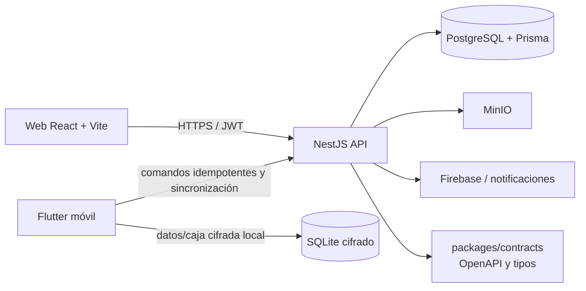
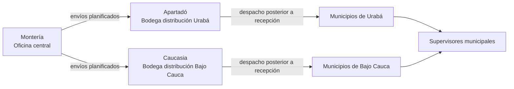

# FuturaGest — contexto operativo para agentes

> **Propósito:** permitir que cualquier agente retome el desarrollo sin reconstruir el contexto desde cero.
>
> **Última verificación:** 10 de agosto de 2026. Este documento describe el estado del código local y la infraestructura versionada; antes de cambiar producción se debe verificar el estado real en Dokploy y sus registros.

## Inicio rápido

1. Trabajar únicamente en `D:\DEV\futuragest` y en sus tres submódulos.
2. Leer este documento, después el código del módulo afectado y sus pruebas cercanas.
3. Ejecutar los chequeos del módulo que se modifica antes de publicar.
4. Publicar primero el repositorio del submódulo y luego actualizar el _gitlink_ en el repositorio raíz.
5. No versionar secretos, APK/keystores, archivos `.env` ni `doc/inventario/dashboard/`.

La fuente de verdad técnica es el código y las migraciones. `PROJECT.md` y otros documentos históricos contienen contexto útil, pero partes de ellos preceden la aplicación web y el módulo de Inventario; no deben prevalecer sobre este archivo ni sobre el código vigente.

## Topología de repositorios

| Ubicación local                      | Repositorio remoto                        | Rol                                                                            | Referencia local verificada                                         |
| ------------------------------------ | ----------------------------------------- | ------------------------------------------------------------------------------ | ------------------------------------------------------------------- |
| `D:\DEV\futuragest`                  | `jonnatanba1/Futuragest-backend-frontend` | Repositorio de coordinación: submódulos, contratos, despliegue y documentación | `eaecac2` antes de crear este documento                             |
| `D:\DEV\futuragest\backend`          | `jonnatanba1/futuragest-backend`          | API NestJS, Prisma y migraciones                                               | `e24812c` — `feat(inventory): georeference municipality network`    |
| `D:\DEV\futuragest\frontend_web`     | `jonnatanba1/futuragest-web`              | Panel web React/Vite                                                           | `7910328` — `fix(dashboard): fit municipality chart without scroll` |
| `D:\DEV\futuragest\frontend_flutter` | `jonnatanba1/futuragest-frontend-flutter` | Aplicación móvil Flutter                                                       | `aec5e6f` — `build(android): standardize universal test APKs`       |

Los tres directorios anteriores son repositorios Git independientes, añadidos al repositorio raíz como submódulos. La rama de entrega habitual es `main`.

### Flujo Git obligatorio

```text
cambio en backend/web/flutter
        │
        ├─► commit + push del submódulo (main)
        │
        └─► desde D:\DEV\futuragest:
             git add backend | frontend_web | frontend_flutter
             git commit -m "chore: update <módulo> reference"
             git push origin main
```

- Los commits usan Conventional Commits y nunca incluyen atribución de IA.
- Antes de publicar, confirmar `git status --short` en el submódulo y en la raíz.
- `doc/inventario/dashboard/` es una referencia visual local no versionada; contiene material de exploración y no debe incluirse accidentalmente en un commit.
- El remoto raíz también tiene alias `canonical-backend` y `canonical-web`, pero los cambios de producto se hacen dentro de cada submódulo, no mediante esos alias.

## Infraestructura y despliegue

### Producción

- El despliegue productivo se administra con **Dokploy** y se alimenta desde los repositorios Git en `main`.
- La API pública configurada para la web es `https://backfuturagest.jjsoftech.com`.
- La disponibilidad actual debe verificarse antes de diagnosticar un incidente: `GET /health` y los registros del servicio en Dokploy. Un `503` puede ser un contenedor reiniciando, una migración en curso o una configuración de proxy; no asumir la causa.
- No incorporar aquí ni en tickets contraseñas, URIs de bases de datos, JWT, claves de Firebase/Maps/MinIO ni contenido de `.env`.

### Stack versionado

`deploy/docker-compose.yml` documenta el stack base:

| Servicio | Tecnología                    | Persistencia / exposición                                                               |
| -------- | ----------------------------- | --------------------------------------------------------------------------------------- |
| Proxy    | Traefik v3 + Let's Encrypt    | HTTP/HTTPS, certificados persistentes                                                   |
| API      | Node 20 / NestJS              | Puerto interno 3000; healthcheck `/health`                                              |
| Web      | Nginx con SPA React compilada | Puerto interno 80; `API_ORIGIN` se inyecta en tiempo de ejecución mediante `/config.js` |
| Datos    | PostgreSQL 16                 | Volumen `pgdata`, red interna                                                           |
| Archivos | MinIO                         | Volumen `miniodata`; API S3 mediante ruta TLS                                           |

El compose usa rutas genéricas basadas en `DOMAIN`, mientras Dokploy tiene dominios reales propios. Esta diferencia es intencional de plantilla, pero obliga a contrastar variables y rutas del servicio activo antes de desplegar.

### Migraciones y producción

La imagen del backend ejecuta `pnpm exec prisma migrate deploy` antes de iniciar la API. Para una migración nueva:

1. Crear y revisar la migración en desarrollo dentro de `backend/prisma/migrations/`.
2. Probarla contra una copia o entorno seguro.
3. Hacer respaldo y confirmar la autorización explícita para producción.
4. Desplegar el backend; usar **`migrate deploy`**, nunca `migrate dev` en producción.
5. Revisar registros, `/health` y el flujo afectado.

Las migraciones recientes de Inventario incluyen la base del módulo, recepción con evidencia GPS/biométrica, conciliación de ubicaciones municipales, entradas de stock, distribución por zona y coordenadas municipales. No editar migraciones ya aplicadas: crear una nueva migración.

## Arquitectura técnica



### Backend — `backend`

- **Stack:** Node 20, TypeScript, NestJS 10, Prisma 7, PostgreSQL, Argon2, JWT, MinIO, Firebase Admin y Swagger.
- **Entrada:** `src/main.ts`; valida DTO globalmente con `ValidationPipe({ whitelist: true })`, configura CORS mediante `CORS_ORIGINS`, publica Swagger en `/api-docs` y escucha `PORT` o 3000.
- **Módulos:** `auth`, `iam`, `asistencia`, `jornada`, `novedades`, `compensacion`, `reportes`, `notifications`, `storage` e `inventario`.
- **Organización:** cada módulo mantiene capas `domain`, `application`, `infrastructure` e `interface` cuando aplica. Evitar colocar reglas de negocio en controladores.
- **Persistencia:** `prisma/schema.prisma`; las migraciones son parte del contrato de producción.
- **Contratos:** la generación de OpenAPI alimenta `packages/contracts/openapi.json` cuando se ejecuta `pnpm generate:openapi`.
- **Comandos principales:** `pnpm start:dev`, `pnpm test`, `pnpm test:unit`, `pnpm test:int`, `pnpm lint`, `pnpm typecheck`, `pnpm build`.

### Frontend web — `frontend_web`

- **Stack:** React 18, TypeScript, Vite 6, Mantine 7, TanStack Query, Recharts, Leaflet y Tabler Icons.
- **Rutas:** `src/app/router.tsx`; las funcionalidades se cargan de forma diferida por ruta.
- **Features:** `admin`, `asistencia`, `auth`, `compensacion`, `config`, `dashboard`, `inventario`, `novedades`, `operarios`, `reportes` y `shell`.
- **Autorización UI:** `src/lib/auth/roles.ts`. La UI mejora la experiencia, pero el backend siempre debe validar roles y ámbito.
- **Configuración de API:** el valor de compilación es un respaldo; en producción Nginx crea `/config.js` usando `API_ORIGIN`. Un cambio de origen no debe requerir recompilar el frontend.
- **Comandos principales:** `pnpm dev`, `pnpm test`, `pnpm lint`, `pnpm typecheck`, `pnpm build`.

### Aplicación Flutter — `frontend_flutter`

- **Stack:** Flutter/Dart, Riverpod, Dio, `flutter_secure_storage`, Drift, `sqlite3`, SQLite3 Multiple Ciphers, Workmanager, `connectivity_plus`, `local_auth`, Geolocator y Firebase Messaging.
- **Features existentes:** autenticación, asistencia, inventario, novedades y perfil.
- **Inventario móvil:**
  - `application/`: captura, coordinación de sesión y sincronización en segundo plano.
  - `data/`: contexto, base local, apertura cifrada, almacenamiento de llave y motor de sincronización.
  - `presentation/`: pantallas y componentes del módulo.
- **Regla crítica:** la base local de Inventario debe mantenerse cifrada; no sustituir el flujo de apertura por SQLite sin cifrado ni almacenar llaves en texto plano.
- **APK:** para pruebas, incrementar la versión de `pubspec.yaml`, conservar siempre la misma clave de firma productiva y generar primero el APK universal con `flutter build apk --release`. Un APK firmado con otra clave no puede actualizar una instalación existente con el mismo `applicationId`; debe desinstalarse la anterior o firmarse con la clave original. Play Protect puede advertir en distribución por sideload; para distribución interna sostenida, preferir un canal interno de Google Play.

### Monorepo raíz y contratos

- `packages/contracts`: OpenAPI y tipos compartidos.
- `deploy`: compose y ejemplos de variables de infraestructura.
- `doc`: documentación funcional y referencias; el dashboard de referencia es local/no rastreado.
- `scripts/scan-secrets.mjs`: control de secretos que también ejecuta CI.
- GitHub Actions (`.github/workflows/ci.yml`) instala con `pnpm --frozen-lockfile`, levanta PostgreSQL/MinIO de prueba y ejecuta lint, pruebas, build, OpenAPI y typecheck.

## Seguridad y reglas no negociables

- No revelar, registrar ni subir secretos. Usar `.env.example` solo como lista de nombres de variables.
- Las credenciales se almacenan con Argon2; nunca leer ni entregar hashes/contraseñas de usuarios.
- Los tokens y la autorización se validan en el backend. Ninguna validación exclusiva de la UI es suficiente.
- Toda operación offline debe usar identificadores de comando únicos e idempotencia para soportar reintentos sin duplicar salidas o recepciones.
- Inventario debe conservar auditoría: actor, dispositivo, hora, evidencia de recepción, geolocalización cuando exista y movimientos que expliquen el balance.
- Para acciones irreversibles o cambios de datos productivos: respaldo, autorización explícita y registro verificable del resultado.

## Dominios funcionales

| Dominio                    | Responsabilidad                                                               | Estado / puntos de atención                                                                                                                                          |
| -------------------------- | ----------------------------------------------------------------------------- | -------------------------------------------------------------------------------------------------------------------------------------------------------------------- |
| IAM y autenticación        | Usuarios, roles, cambio obligatorio de contraseña y ámbitos operativos        | Roles vigentes: `SYSTEM_ADMIN`, `GERENCIA`, `TALENTO_HUMANO`, `LIDER_OPERATIVO`, `COMPRAS`, `COORDINADOR`, `SUPERVISOR`. Confirmar permisos API al ampliar un flujo. |
| Asistencia y jornada       | Ingreso, faltas, turnos y políticas de jornada                                | El dashboard usa estos datos; evitar KPI globales sin detalle cuando la solicitud es análisis por municipio/área.                                                    |
| Novedades y compensación   | Gestión, aprobación y cálculo operativo                                       | Validar permisos y estados del flujo antes de modificar.                                                                                                             |
| Operarios y administración | Directorios, municipios, zonas, áreas y maestros                              | Municipios, supervisores y coordinadores ya existen: reutilizar estas entidades, no duplicarlas.                                                                     |
| Inventario                 | Catálogo, entradas, stock, envíos, recepción, conteos, alertas y trazabilidad | Dominio activo con validaciones y lógica offline; ver sección siguiente.                                                                                             |
| Notificaciones             | Avisos de acciones operativas y envíos                                        | Probar en dispositivo real las notificaciones y la navegación de destino.                                                                                            |

## Inventario: modelo operativo vigente

### Red logística



1. **Compras** registra entradas sin costo en la bodega central de Montería y puede consultar stock y alertas.
2. Desde Montería se planifica lo destinado a los municipios; la distribución física pasa primero por Apartadó (Urabá) o Caucasia (Bajo Cauca).
3. El coordinador de zona recibe el envío. Solo tras confirmarlo puede distribuir a los municipios de su zona.
4. El supervisor asignado al municipio recibe el envío y confirma con biometría. El registro debe incluir hora/fecha, ubicación GPS cuando esté disponible, dispositivo y método/evidencia de verificación.
5. Las salidas de un supervisor reducen su saldo. No se permite despachar o registrar salida por encima del stock disponible.
6. Cada producto conserva trazabilidad de entradas, salidas, origen/destino y saldo mediante `InventoryMovement` y `InventoryBalance`.

### Invariantes de implementación

- La bodega central única es **Oficina central Montería**.
- Apartadó y Caucasia son bodegas de distribución por zona; los municipios son destinos operativos, no una segunda entidad municipal duplicada.
- Compras puede seleccionar a un supervisor o a un coordinador de zona como receptor cuando el flujo lo permita; la asignación debe respetar el destino y la zona.
- Las unidades se eligen de una lista. La equivalencia a unidad base solo aplica a unidades derivadas; cantidades y saldos admiten decimales.
- Productos agotados no deben aparecer como disponibles para una salida.
- Las notas opcionales de compra/entrada (proveedor, remisión u observación) admiten texto largo.
- Una discrepancia en recepción no se cierra como recibida normal: se registra y se gestiona mediante revisión/resolución.
- No eliminar ni reescribir movimientos para “corregir” saldo: usar reversos, ajustes aprobados o conteos según la regla de negocio.

### API de Inventario

El prefijo es `/inventario`. El controlador de operaciones cubre catálogo, unidades, ubicaciones/asignaciones, mínimos, entradas (`POST /stock/entries`), balances, movimientos, alertas, conciliación, métricas, envíos, recepciones, devoluciones y conteos. El controlador de sincronización expone `/context`, `/sync` y `/events/status`.

Antes de cambiar un endpoint, revisar los DTO, los servicios de aplicación, las políticas de roles y los consumidores web/móvil. Una respuesta `404` en un endpoint existente puede indicar que Dokploy está ejecutando un commit anterior, no que la ruta deba recrearse.

### Estado de UI de Inventario

- La web tiene catálogo/Inventario, entradas mediante modal, detalle de producto, movimientos trazables, mínimos, envíos, detalle con histórico de creación-despacho-recepción, filtros y mapa de red.
- El mapa de red no usa Google Maps por decisión de producto: es una visualización propia, animada y adaptada al tema claro/oscuro. Al cambiarla, mantener un sistema de coordenadas único para SVG y nodos; mezclar `viewBox` con posiciones porcentuales del contenedor puede desalinear los puntos en móviles.
- Las cadenas del frontend son UTF-8 correcto. Si PowerShell muestra `EnvÃos` o caracteres similares, primero verificar bytes/codificación: se ha observado que puede ser solo una representación de consola. No hacer reemplazos masivos a ciegas.
- La app Flutter conserva inventario local y cola de sincronización. Cualquier cambio debe ensayarse sin conexión, reintento, reconexión y reinicio de la aplicación.

## Dashboard operativo actual

La vista web principal está en `frontend_web/src/features/dashboard/`.

- La primera visualización es una gráfica de faltas por municipio y área para los 13 municipios.
- Tiene modos **apilado** y **agrupado**, debe mostrar todos los municipios sin scroll horizontal y respetar tema claro/oscuro.
- Debajo se mantienen tarjetas desplegables por municipio; el detalle debe ser compacto por áreas, no una tarjeta vertical interminable.
- Al seleccionar un municipio, el perfil/detalle operativo se abre como modal. Al seleccionar **Ingresaron** o **Faltaron**, se muestra el listado de personas correspondiente.
- No reintroducir tarjetas globales que solo muestren totales de faltas, jornadas abiertas, llegadas tarde o novedades sin detalle: fueron retiradas por decisión de producto.
- Las últimas pruebas de este conjunto cubrían `DashboardPage` e `dashboard-metrics`; actualizar pruebas al alterar métricas, estados vacíos o interacción de modales.

## Estrategia de trabajo y validación

### Antes de editar

- Identificar los tres consumidores potenciales: modelo Prisma/API, web y Flutter.
- Buscar pruebas próximas al feature y extenderlas en vez de depender solo de revisión visual.
- Revisar las migraciones y el estado existente antes de modificar stock, saldos, roles o referencias de ubicación.
- Para UI, usar el sistema de tema existente; no imponer fondos azules o tarjetas que rompan la estética solicitada.

### Validaciones mínimas por cambio

| Cambio                    | Validación mínima                                                                                                  |
| ------------------------- | ------------------------------------------------------------------------------------------------------------------ |
| Backend o Prisma          | pruebas del módulo, `pnpm lint`, `pnpm typecheck`, `pnpm build`; migración revisada si corresponde                 |
| Web                       | pruebas del feature, `pnpm lint`, `pnpm typecheck`, `pnpm build`; verificar tema claro y oscuro                    |
| Flutter                   | `flutter analyze`, pruebas disponibles y compilación APK de prueba cuando afecta entrega Android                   |
| Integración de inventario | escenario con/sin red, duplicado de comando, límite de stock, recepción aprobada/discrepancia y trazabilidad final |
| Despliegue                | commit correcto en Dokploy, logs, migración aplicada, `/health` y prueba funcional autenticada                     |

## Riesgos y trabajo pendiente conocido

1. **Móvil en producción/pruebas:** la continuidad de firma APK y la instalación en dispositivos deben validarse con la clave correcta; no generar una clave nueva esperando actualizar instalaciones existentes.
2. **Sincronización móvil:** probar en dispositivos reales notificaciones de envío, cola offline, reconexión y respuesta del canal de plataforma; los errores transitorios de canales requieren evidencia de logs antes de modificar lógica.
3. **Despliegue Dokploy:** no asumir que un push implica que la versión ya está activa. Verificar hash/registro del despliegue y endpoints.
4. **Inventario:** toda evolución debe preservar el ledger, idempotencia, límite de stock y evidencia de recepción, además del enrutamiento Montería → zona → municipio.
5. **Documentación:** actualizar este archivo al cambiar infraestructura, una decisión de flujo, contrato API, ruta de repo o procedimiento de entrega.

## Documentación y archivos de consulta

| Archivo / directorio                             | Uso                                                                                    |
| ------------------------------------------------ | -------------------------------------------------------------------------------------- |
| `D:\DEV\futuragest\INVENTARIO_PLAN.md`           | Plan histórico/funcional inicial de Inventario; contrastar con el flujo zonal vigente. |
| `D:\DEV\futuragest\PROJECT.md`                   | Arquitectura y decisiones originales; contiene secciones históricas.                   |
| `D:\DEV\futuragest\memorias.md`                  | Notas históricas del proyecto; no sustituye las migraciones ni este handoff.           |
| `D:\DEV\futuragest\deploy\docker-compose.yml`    | Stack de referencia y variables de despliegue.                                         |
| `D:\DEV\futuragest\backend\prisma\schema.prisma` | Modelo actual de datos.                                                                |
| `D:\DEV\futuragest\backend\prisma\migrations`    | Evolución irreversible de la base de datos.                                            |
| `D:\DEV\futuragest\doc\inventario\dashboard\`    | Referencia visual local no rastreada; no publicar.                                     |

## Checklist para cerrar una tarea

- [ ] Cambié solamente los repositorios necesarios.
- [ ] Ejecuté pruebas, análisis, lint y build aplicables.
- [ ] Revisé que no se añadieron secretos ni archivos locales.
- [ ] Confirmé `git status` limpio salvo referencias locales intencionales.
- [ ] Publiqué el submódulo en `main` y actualicé el _gitlink_ raíz si aplica.
- [ ] Verifiqué el despliegue real cuando la tarea lo requería.
- [ ] Actualicé este documento y la memoria de proyecto si la decisión o infraestructura cambió.
